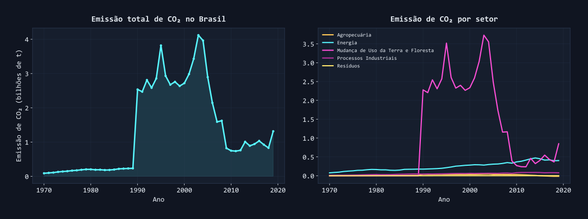
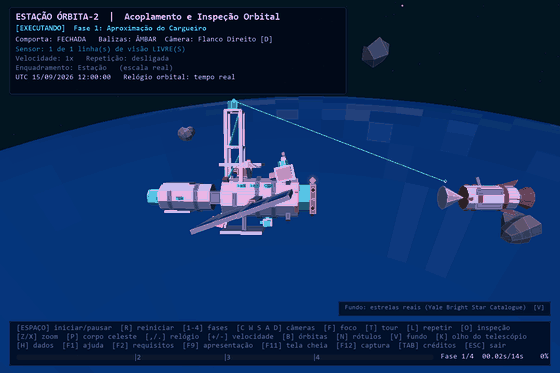
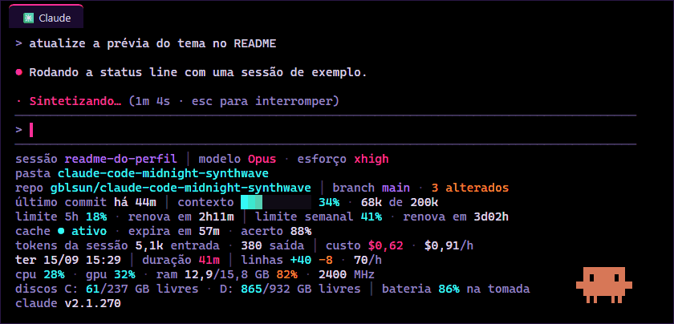
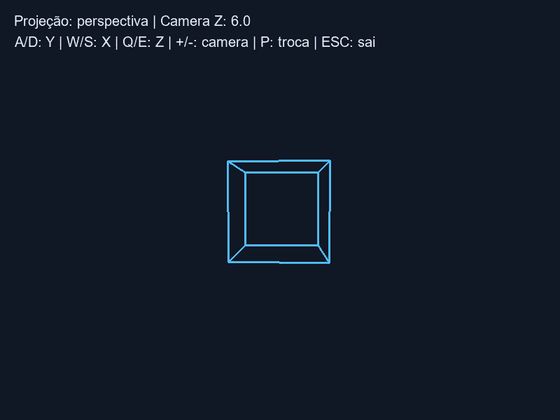
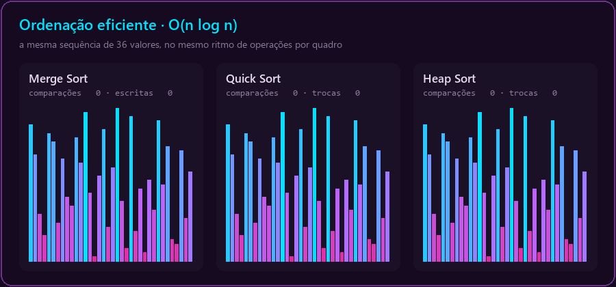
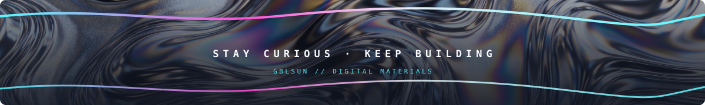

 

    

 

  

        

## 🪩 About me

<table>
<tr>
<td width="55%" valign="top">

I am passionate about technology and innovation. Currently, I work as an **Advisory Consulting Intern** at **PwC**, focusing on **Data & Analytics**, while in my 6th semester of **Computer Science** at Faculdade Impacta de Tecnologia. I dedicate my studies to software development, data analysis, and creative design, constantly improving my skills in **Python**, **Java**, **TypeScript**, **JavaScript**, **C**, **Elixir**, and **Artificial Intelligence**.

My goal is to create technological solutions that make a difference, always combining **creativity** with **efficiency**.

</td>
<td width="45%" valign="top">

</td>
</tr>
</table>

**🌱 Currently focusing on**

Exploring **Microsoft Azure**, **Artificial Intelligence**, and **Machine Learning** — deepening the Data & Analytics experience I already have at PwC. In the 6th semester, the practical labs include **Compilers** (the MiniC lexer, in Python and C), **3D Computer Graphics** (the Orbit-2 station, without OpenGL), and **Statistical Inference** (reliability of 500 cloud servers using PCA and KNN).

    

## 🛣️ Journey

## 🕹️ Stack

**Languages**

  

**🎨 Design**

  

**IDEs & Editores**

  

**Systems, Hardware & Cloud**

  

**Data & Frameworks**

## 📊 GitHub Stats

### 🐍 Contribution Grid

<picture>
  <source media="(prefers-color-scheme: light)" srcset="https://raw.githubusercontent.com/gblsun/gblsun/output/github-contribution-grid-snake-light.svg" />
  
</picture>

  

## 🚀 Featured Projects

<table>
  <tr>
    <td width="50%" valign="top">
      <h3>🌎 Analysis and Projection of CO₂ Emissions in Brazil</h3>
      
      
My most complete project so far, developed in a group: comparison of 6 regression algorithms (Random Forest and KNN achieved R² > 0.92), long-term projections, and sectoral analysis of CO₂ emissions in Brazil.

      
      
      
       
      
      
        
      
    </td>
    <td width="50%" valign="top">
      <h3>🛰️ Orbit-2 Station · 3D Virtual World</h3>
      
      
Projeto em grupo de Computer Graphics e RA/RV, em que fiquei com a modelagem e a composição da cena: uma estação orbital 3D animada e interativa feita só com Python e Pygame, sem OpenGL, motor 3D ou numpy. Todo o pipeline é calculado à mão: câmera look-at, projeção em perspectiva, culling, ordenação por profundidade e sombreamento Lambertiano.

      
      
      
       
      
      
        
      
    </td>
  </tr>
  <tr>
    <td width="50%" valign="top">
      <h3>⚙️ MiniC Compiler · Lexical Analyzer</h3>
      
      
Etapa 1 do compilador da linguagem MINIC, feita em grupo para a disciplina de Compilers: o mesmo lexer implementado em Python <strong>e</strong> em C, com tokens e erros idênticos nas duas versões, testes de regressão com golden files e uma interface em Streamlit para testar código na hora.

      
      
      
       
      
      
        
      
      
    </td>
    <td width="50%" valign="top">
      <h3>🌃 Claude Code · Midnight Synthwave</h3>
      
      
A late-night synthwave theme for Claude Code in Windows Terminal: Portuguese status line with context, limits, cache, cost, CPU, GPU, and RAM, subagent line, translated spinner, and Zelda's <em>Secret Sound</em> when a task finishes. Accessible palette that never relies on green and red.

      
      
      
       
      
      
        
      
    </td>
  </tr>
  <tr>
    <td width="50%" valign="top">
      <h3>📚 Knowledge Repo</h3>
      
      
A repository with my entire study journey in Computer Science: programming techniques in Python, web portfolio in HTML/CSS, computer graphics, and much more.

      
      
      
       
      
      
        
      
      
      
    </td>
    <td width="50%" valign="top">
      <h3>🧮 Algorithms and Data Structures</h3>
      
      
Collaborative repository solving Algorithms and Data Structures exercises — Quick Sort, Merge Sort, recursion, among others — divided among team members.

      
      
       
      
      
        
      
    </td>
  </tr>
</table>

### ✨ Other finds on my GitHub

## 🎓 Courses & Certifications

<table>
  <tr>
    <td width="50%" valign="top">
      <h4>🧠 CS50 · Harvard University</h4>
      
C fundamentals and problem-solving: syntax, input and output, conditionals, loops, and structured programming, from the CS50 course.

      
    </td>
    <td width="50%" valign="top">
      <h4>🔄 ETL na Prática · Impacta</h4>
      
Complete pipeline for data extraction, transformation, loading, and analysis with Python, pandas, and SQLite. 4-hour course, with a certificate.

      
    </td>
  </tr>
  <tr>
    <td width="50%" valign="top">
      <h4>☕ Java Programmer · Impacta My Way</h4>
      
Module I: introduction to the Java language, data types, literal values, and variables.

      
    </td>
    <td width="50%" valign="top">
      <h4>💻 Técnico em Informática para Internet · ETEC</h4>
      
Completed in 2023: HTML, CSS, JavaScript, programming logic in C, and web projects, from institutional websites to interfaces.

      
    </td>
  </tr>
</table>

## ✍️ Publications

 

## 🎧 Spotify

  

## 📡 Contact

I am always open to collaborating on projects, sharing ideas, and finding amazing opportunities.
**Let's turn ideas into reality!**

 

  

