&nbsp;
&nbsp;
&nbsp;
&nbsp;

 

## 🌆 Sobre mim

<table>
<tr>
<td width="55%" valign="top">

Sou apaixonado por tecnologia e inovação. Atualmente atuo como **Intern em Advisory Consulting**, com foco em **Data & Analytics**, enquanto curso **Ciência da Computação** na Faculdade Impacta de Tecnologia. Dedico meus estudos ao desenvolvimento de software, análise de dados e ao design criativo, aprimorando constantemente minhas habilidades em **Python**, **Java**, **TypeScript**, **C**, **Elixir** e **Inteligência Artificial**.

Meu objetivo é criar soluções tecnológicas que façam a diferença, sempre combinando **criatividade** com **eficiência**.

</td>
<td width="45%" valign="top">

</td>
</tr>
</table>

## 🕹️ Stack

**Linguagens**

  

**🎨 Design**

  

**IDEs & Editores**

  

**Sistemas, Hardware & Cloud**

  

**Dados & Frameworks**

## 📊 GitHub Stats

  

**🗂️ Linguagens mais usadas**

  

### 🐍 Grid de Contribuições

## 🚀 Projetos em destaque

<table>
  <tr>
    <td width="50%" valign="top">
      <h3>🌎 Análise e Projeção de Emissão de CO₂ no Brasil</h3>
      
Meu projeto mais completo até aqui: análise exploratória e projeção de emissões de CO₂ no Brasil, com notebooks Jupyter, base de dados tratada e relatórios executivos entregues em HTML, PDF e apresentação.

      
      
      
        
      
    </td>
    <td width="50%" valign="top">
      <h3>📚 Knowledge Repo</h3>
      
Repositório com toda a minha trajetória de estudos em Ciência da Computação: técnicas de programação em Python, portfólio web em HTML/CSS e muito mais.

      
      
      
        
      
      
    </td>
  </tr>
  <tr>
    <td width="50%" valign="top">
      <h3>🧮 Algoritmos e Estruturas de Dados</h3>
      
Repositório colaborativo com resolução de exercícios de Algoritmos e Estruturas de Dados — Quick Sort, Merge Sort, recursividade, entre outros — dividido entre os membros da equipe.

      
      
        
      
    </td>
    <td width="50%" valign="top">
      <h3>🎬 Locadora de Filmes (POO)</h3>
      
Sistema de gerenciamento de locadora de filmes desenvolvido como atividade avaliativa de Programação Orientada a Objetos.

      
      
        
      
    </td>
  </tr>
</table>

### ✨ Outros achados no meu GitHub

## ✍️ Publicações

 

<strong>📜 Últimas publicações no Medium</strong>

 

## 🎧 Spotify

  

## 📡 Contato

Estou sempre aberto a colaborar em projetos, compartilhar ideias e encontrar oportunidades incríveis.
**Vamos transformar ideias em realidade!**

&nbsp;

  

</content>
